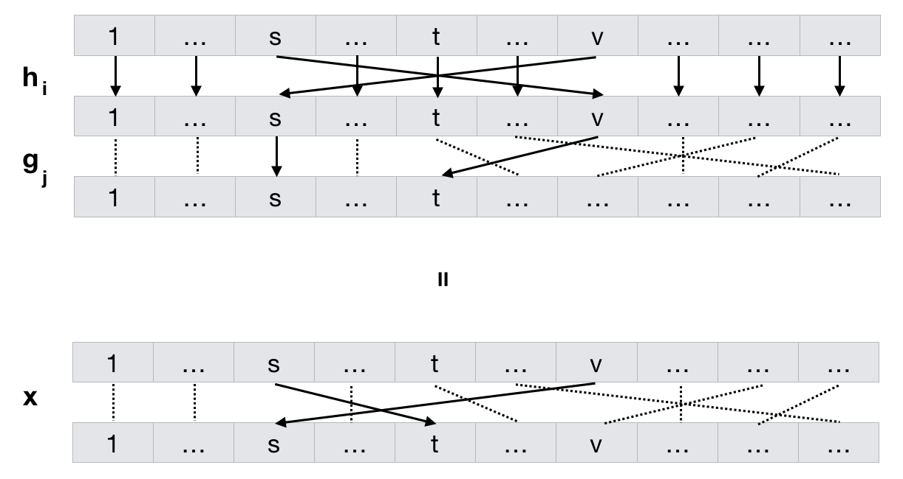

# Orbit-Stablizer Theorem
## Introduction

### Setting
* Let $S$ be a set, $s \in S$.
* Let $G$ be a _permutaion group_ on $S$, (or we say $G$ _acts_ on $S$). That means $G$ is isomorphic to a subgroup of permutations on $S$, $G \approx H \leq Perm(S)$. We can see every $x \in G$ as a bijection from $S$ to $S$, so the symbol $x(s)$ means the image of $s \in S$ under function $x$. Often we also write $xs$ to denote $x(s)$. 

### Definitions
* The _stablizer_ of $s$ in G, denoted by $Stab_G(s)$, is  
$$ Stab_G(s) = \{ x \in G: xs = s \} $$
 In words, they are all the permutations $x$ in $G$ that leaves $s$ as it is (so they all 'stablize' $s$).
* The _orbit_ of $s$ under $G$ is,
$$ Orb_G(s) = \{ xs: x \in G \} $$
 That is, orbit of $s$ is the set of all the destinations it can go.

## Theorem
* $Stab_G(s) \leq G$, and
$$ |G| = |Orb_G(s)| \cdot |Stab_G(s)| $$
 note that $Stab_G(s)$ is a subset (or further, subgroup) of $G$, while $Orb_G(s)$ is subset of $S$, sort of nothing to do with $G$.

## Interpretation
The theorem suggests that there might be a one-to-one mapping between pairs of indices $(i,j)$, **I'd** call them _Orb\_Index_ and _Stab\_Index_, and elements in $G$. We can visualize them in a table, where the columns correspond to _Stab\_Index_ and rows being _Orb\_Index_:

|                       | 1 | 2 | ... | j | ... | $\vert Stab_G(s) \vert$ |
|-----------------------|---|---|-----|---|-----|-------------------------|
| 1                     | 1 |   |     |   |     |                         |
| 2                     |   |   |     |   |     |                         |
| ...                   |   |   |     |   |     |                         |
| i                     |   |   |     | x |     |                         |
| ...                   |   |   |     |   |     |                         |
| $\vert Orb_G(s)\vert$ |   |   |     |   |     |                         |

Any $x \in G$ can be identified by a cell $(i,j)$ in this table. Let $t = t_i \in S$ denote the destination of $s$ under $x = x_{i,j}$ and let $v$ denote the pre-image of $s$ under $x$: 
$$t = x(s)$$
$$v = x^{-1}(s)$$
and let $h_i$ denote the mapping in $G$ that only swap $s$ and $v$, leaving others as it is. i.e.:

$$h_i(s) = v$$
$$h_i(v) = s$$
$$h_i(u) = u\; for\; u \neq s\; or\; v$$

and let $g_j \in Stab_G(s)$ represents mapping that stablizes $s$ (as it is in $Stab_G(s)$), maps $v$ to $t$, while preserve the other mappings of $x$ except $s$ and $v$:

$$g_j(s) = s$$
$$g_j(v) = t$$
$$g_j(u) = x(u)\; otherwise$$

Under this setting, $x$ is a composition of $h_i$ and $g_j$:
$$ x = g_j \circ h_i$$

This concept may be better illustrated by:

